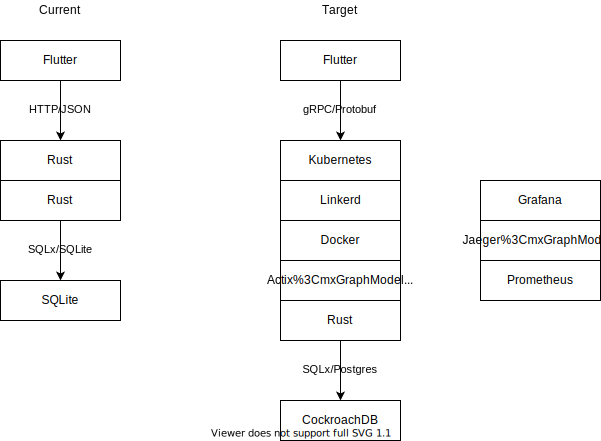

# Heath

Health without taking an L

## Architecture

## Features

Workouts:
[✓] Record & manage workouts
[_] Show trend in total weight lifted in workouts over time
[_] Recommend next workout based on previous workouts

Diet
[_] Record & manage diet/groceries
[_] Show trend in macros over time
[_] Recommend target calories, macros, and micros for day
[_] Recommend next meal based on previous meal

Weight
[_] Record & manage weight
[_] Show trend in weight over time

Sleep
[_] Record & manage sleep/caffeine
[_] Show sleep trends overlayed with caffeine intake

## Development

### Spinning up the project

- Start minikube with `minikube start`
- Build & deploy services with `skaffold dev -f infra/skaffold.yaml`
  - If this fails with a missing `CrdbCluster` message, `kubectl apply` the missing CockroachDB manifests
- Expose the ingress on localhost with `minikube tunnel` (required on MacOS, otherwise just send requests to `minikube ip`)

### Connecting to the DB

- Start a client pod with `kubectl exec -it cockroachdb-client-secure -- ./cockroach sql --certs-dir=/cockroach/cockroach-certs --host=cockroachdb-public`
- Open a shell with `kubectl exec -it cockroachdb-client-secure -- ./cockroach sql --insecure --host=cockroachdb-public`

## References

- SQLx: https://github.com/launchbadge/sqlx
- Actix SQLx example: https://github.com/actix/examples/tree/master/database_interactions/sqlx_todo
